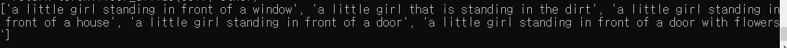
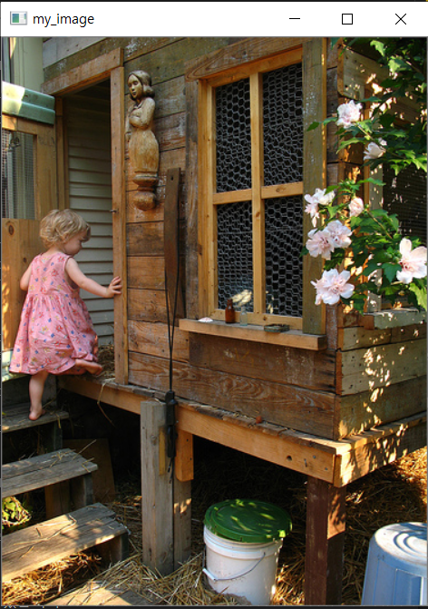

## 특화 프로젝트 SubProject01

#### 서브프로젝트1 1일차

jira 티켓 등록

팀미팅, 주제선정

아나콘다 설치 및 환경설정 - sub1 명세서대로

<br>

#### 서브프로젝트1 2일차

Request1 

- image data  시각화

- classifier 모델 학습
- loss function, optimizer 설정 

Request2

- requirements.txt 설치

Request3

- build file 빌드 - visual studio c++ build tool 설치 후  build

<br>

#### 서브프로젝트1 3일차

Request1

- classifier 모델 트레이닝, 테스트

Request3

- caption_model 이해

<br>

#### 서브프로젝트1 4일차

Request3

- caption_model 클래스 인스턴스 생성
- 이미지 캡션 및 결과 출력





<br>

errors

```python
# speak_image\IC\vqa_origin\maskrcnn_benchmark\utils\imports.py line 4
if torch._six.PY3: -> if torch._six.PY37: 로 변경해줘야함
```


```
conda install pytorch torchvision torchaudio cudatoolkit=11 -c pytorch

cudatoolkit 버전을 11버전으로 설치
```

<br>

### 서브프로젝트2 1일차

jira 티켓 등록

서비스플로우

특화프로젝트 요구사항 명세서 진행

image classifier tensorflow 로 해보기 [링크](classifier_example_skeleton_by_tf.ipynb)

<br>

### 서브프로젝트2 2일차

특화프로젝트 요구사항 명세서

tts 모델 Tacotron 이해

이미지 캡셔닝 tensorflow로 동작 해보기 [링크](image_captioning_tutorial.ipynb)

<br>

### 서브프로젝트2 3일차

와이어 프레임 구성

tts 모델 Tacotron 이해

<br>

### 서브프로젝트2 4일차

와이어 프레임 구성

tts by torchhub [링크](tts_tutorial.ipynb)

<br>

### 서브프로젝트2 5일차

skeleton project training 부분 (req2) 작성

​	[tacotron2](https://github.com/NVIDIA/tacotron2) <- 해당 링크 참고


