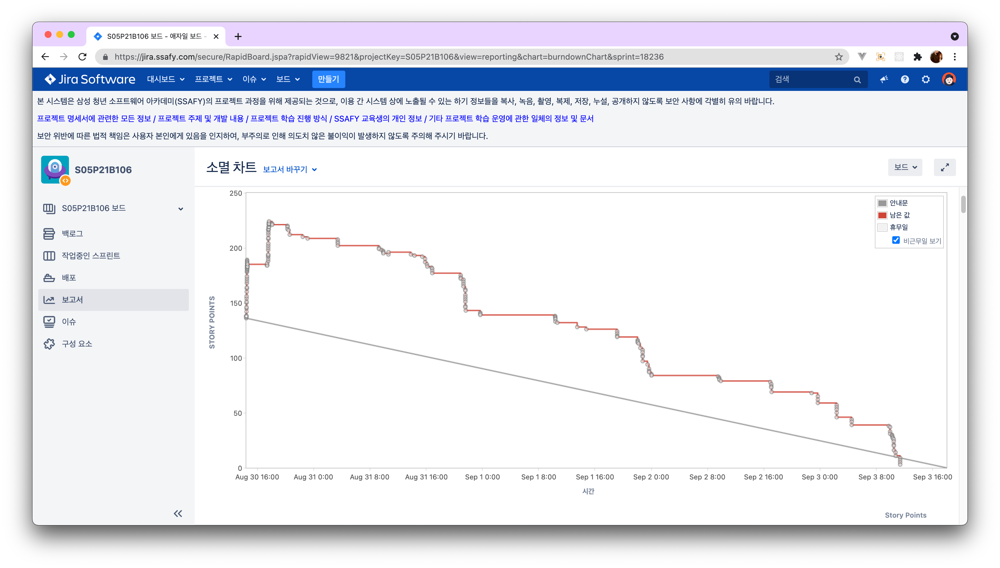

## 개발환경 구성

### 1. 아나콘다 설치 및 기본 설정

#### 일반 콘솔에서 Conda사용하기

``source C:/Users/wns31/anaconda3/etc/profile.d/conda.sh``

#### 설치 명령어

```bash
conda create -n sub01 python=3.7

conda activate sub01

conda install pytorch torchvision torchaudio cudatoolkit=10.1 -c pytorch

pip install tensorflow-gpu
```


---
### 2. 이미지 분류기 구현

> 동일 디렉토리의 req1.py에 관련 내용을 옮겨두었습니다.


---

### 3. Image Captioning 실행 전 사전작업

> 이미지 캡션을 하기 전에 다음과 같은 과정을 수행해야 합니다.

#### Cuda Toolkit 설치

> windows 버전으로 설치합니다

https://developer.nvidia.com/cuda-downloads?target_os=Windows&target_arch=x86_64

#### Visual Studio 설치

> C++로 설치합니다

https://visualstudio.microsoft.com/ko/visual-cpp-build-tools/

#### speak_image\IC\vqa_origin\maskrcnn_benchmark\utils\imports.py 파일 수정

> 4번 줄의 PY3 부분을 PY37로 변경해줍니다.

```python
if torch._six.PY37:
	...
```

#### 프로젝트 루트경로에 있는 README.md의 Pre-trained model & build file 항목에 명시된 파일들을 다운로드 후, IC 경로로 복사

> 각 파일의 내용은 다음과 같습니다

- detection_model.pth
- infos_trains12-best.pkl
- model-best.pth

#### 테스트에 사용 할 이미지 다운로드 후, IC 경로로 복사

> 적절한 이미지를 선택합니다.


#### requirements.txt 파일 작성 & 설치

> 다음과 같은 내용을 기록한 뒤 설치합니다

```bash
pyyaml==5.3.1
yacs==0.1.8
opencv-contrib-python==4.4.0.46
requests==2.25.0
```

##### 설치

```bash
pip install -r requirements.txt
```


---

### 4. image_captioning.py 내용 수정

#### speak_image/IC/vqa_origin 디렉토리로 이동 후, 이미지 캡셔닝에 필요한 빌드 파일 생성

```bash
python setup.py build develop
```

> speak_image/IC/vqa_origin/maskrcnn_benchmark 경로에 _C 로 시작하는 파일이 생성된 것을 확인합니다

#### image_captioning.py 파일 수정

```python
def _build_detection_model(self):

    # 1. detectron_model.yaml의 주소
    cfg.merge_from_file("model_data/detectron_model.yaml")
    cfg.freeze()

    model = build_detection_model(cfg)
    # 2. detectron_model.pth의 주소
    checkpoint = torch.load(
        "detectron_model.pth", 								
        map_location=torch.device("cpu"),
    )
...

# Req. 3-2 클래스 이해
class Caption_Model:
    ...
    def load_model(self):
        # 3. infos_trans12-best.pkl의 주소
        infos = captioning.utils.misc.pickle_load(open("infos_trans12-best.pkl", "rb"))
        infos["opt"].vocab = infos["vocab"]

        self.model = captioning.models.setup(infos["opt"])
        self.model.cuda()
        # 4. model-best.pth의 주소
        self.model.load_state_dict(torch.load("model-best.pth"))
	...
```

#### 이미지 캡션 및 캡션 결과 출력

```python
if __name__ == "__main__":
    cm = Caption_Model()
    feat = cv2.imread("images.jpg")
    result = cm.inference("images.jpg")
    print(result)
    cv2.imshow("타이틀임", feat)
    cv2.waitKey()
```


#### 캡셔닝 실행 및 결과 확인

> 결과는 result를 프린트해서 확인 가능합니다

```
python image_captioning.py
```


---

### 번다운 차트 결과


