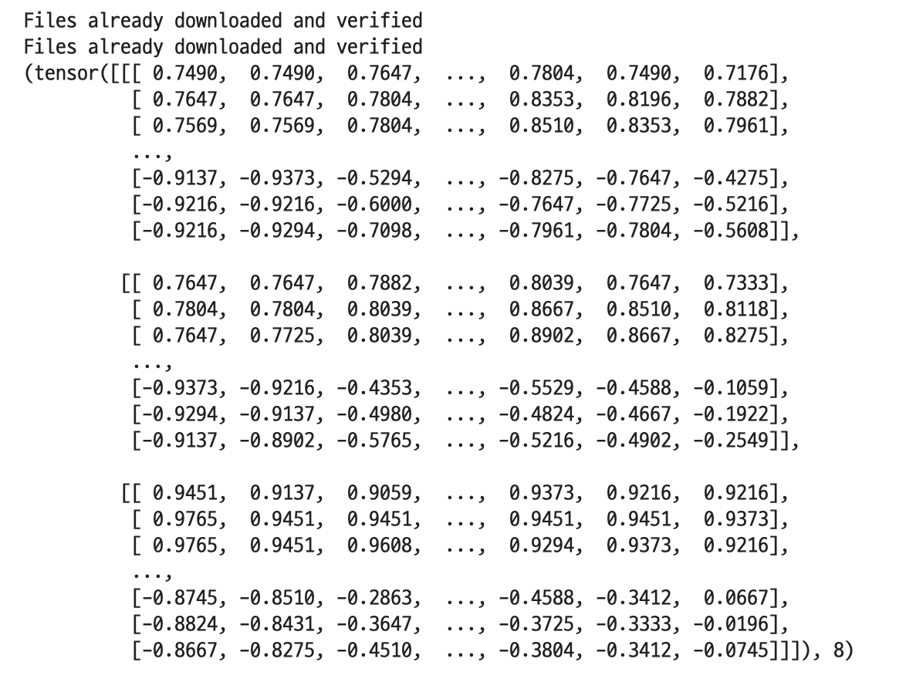
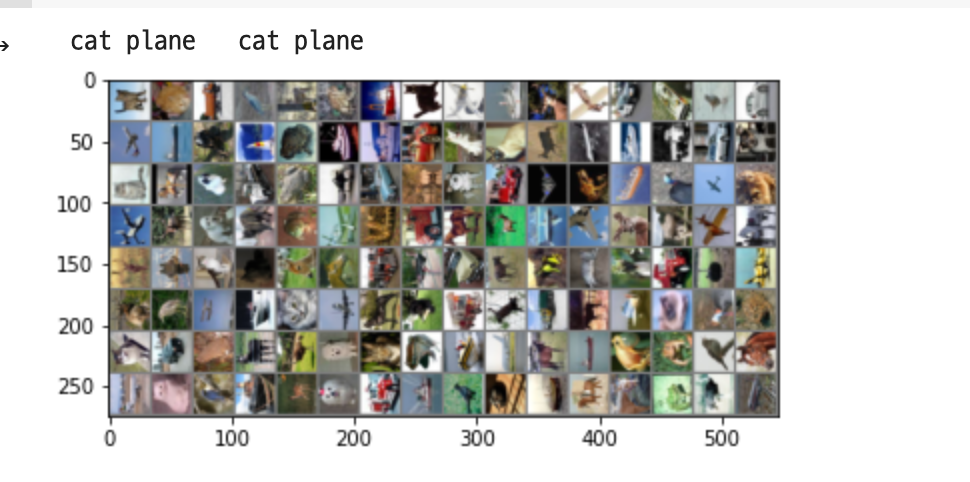
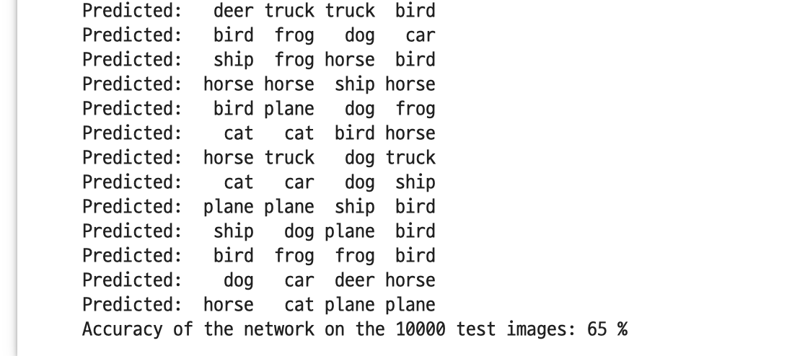
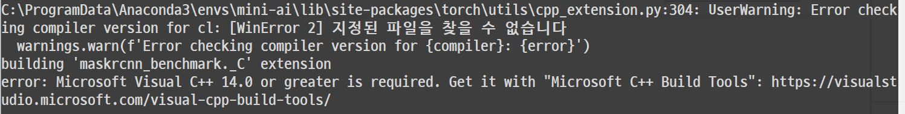
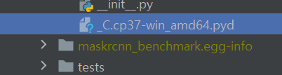
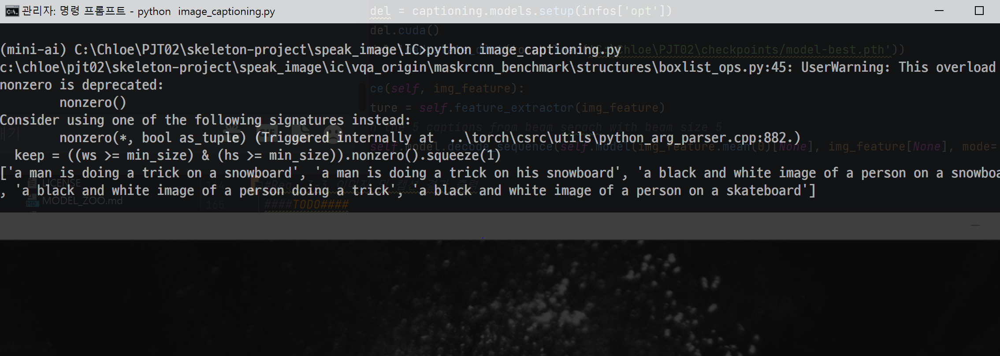

# 01. Anaconda

Download :link: https://www.anaconda.com/products/individual

```bash
% conda-env list # 존재하는 가상환경리스트 조회
% conda list # 현재 환경에 설치된 패키지 확인
% conda create -n mini-ai python=3.7 # 새로운 가상환경 생성
% conda activate mini-ai # 생성한 가상환경 활성화
% conda install pytorch torchvision torchaudio cudatoolkit=10.1 -c pytorch 		 # cudatoolkit은 GPU가 없는 경우 설치X
						#전체한번에 설치가 안되는 경우 각각 설치 해보기
% pip3 install tensorflow # tensorflow 설치

```


# 1-1 Dataset 준비, 전처리

```python
# torch.utils.data.DataLoader class

DataLoader(dataset, batch_size=1, shuffle=False, sampler=None,
           batch_sampler=None, num_workers=0, collate_fn=None,
           pin_memory=False, drop_last=False, timeout=0,
           worker_init_fn=None, *, prefetch_factor=2,
           persistent_workers=False)
```

- `dataset` :  DataLoader클래스의 가장 중요한 파라미터는 dataset이다. 어디서 부터 데이터셋 객체를 가져오는지를 말한다. 두 종류의 데이터셋 타입이 있다.
  - [map-style datasets](https://pytorch.org/docs/stable/data.html#map-style-datasets),
  - [iterable-style datasets](https://pytorch.org/docs/stable/data.html#iterable-style-datasets).

```python
# torchvision으로 CIFAR10 testset load, trainset dataloader 정의
testset = torchvision.datasets.CIFAR10(root='./data', train=False, download=True, transform=transform)
testset.__getitem__(18)
# 생성된 데이터셋인 testset이 어떻게 생겼는지 확인해보기
```




```python
# Req. 1-1	데이터셋 준비 및 전처리
# 이미지를 시각화하는 함수
def visualize(img):
    pass
    # [-1, -1] 범위로 normalize된 데이터를 [0,1] 범위로 unnormalize
    img = img / 2 + 0.5 # [-0.5, 0.5] 인것에 0.5 를 더해 [0, 1]로 normalize
    
    # img를 numpy값으로 변환
    img = img.numpy()

    # plt.imshow함수로 시각화
    plt.imshow(np.transpose(img))

# 트레이닝 데이터를 랜덤 샘플
dataiter = iter(trainloader)
images, labels = dataiter.next() ## image

# show images
visualize(torchvision.utils.make_grid(images))

# print labels
print(' '.join('%5s' % classes[labels[j]] for j in range(4)))
```




# 1-2 분류기 모델 설계

- CNN (Convolutional Neural Network)를 사용하여 모델 설계합니다.

- 이미지는 3-channel을 입력으로 받고, 최종적으로 10개의 class에 대한 확률을 구합니다.

  ```python
  # 앞서서 정의한 클래스 
  # CIFAR10의 10개의 class 정의
  classes = ('plane', 'car', 'bird', 'cat',
             'deer', 'dog', 'frog', 'horse', 'ship', 'truck')
  ```

- 아래의 모델은 예시이므로, layer를 직접 추가해보면서 실험하시길 바랍니다.

```python
import torch.nn as nn
import torch.nn.functional as F

# Req. 1-2	분류기 모델 설계
class Classifier(nn.Module):
      def __init__(self):
          super().__init__()
          self.conv1 = nn.Conv2d(3, 6, 5)
          self.pool = nn.MaxPool2d(2, 2)
          self.conv2 = nn.Conv2d(6, 16, 5)
          self.fc1 = nn.Linear(16 * 5 * 5, 120)
          self.fc2 = nn.Linear(120, 84)
          self.fc3 = nn.Linear(84, 10)

      def forward(self, x):
          x = self.pool(F.relu(self.conv1(x)))
          x = self.pool(F.relu(self.conv2(x)))
          x = torch.flatten(x, 1) # 배치를 제외한 모든 차원을 평탄화(flatten)
          x = F.relu(self.fc1(x))
          x = F.relu(self.fc2(x))
          x = self.fc3(x)
          return x
classifier = Classifier()
print(classifier.conv1)
print(classifier.pool)

print(classifier.fc1)
print(classifier.fc2)
```

# 1-3 모델 학습

- Loss function, Optimizer정의

  ```python
  import torch.optim as optim
  
  # Req. 1-3	Loss function 및 optimizer정의
  
  # loss function
  criterion = nn.CrossEntropyLoss()
  
  # optimizer
  optimizer = optim.SGD(classifier.parameters(), lr=0.001, momentum=0.9)
  ```

  

```python
# Req. 1-4	모델 학습
epochs = 100  #define epochs

# 1) for문으로 epochs 만큼 반복
for epoch in range(epochs):  # epochs 횟수만큼 반복
    
    # loss값 누적 
    running_loss = 0.0
    
    # 2) for문으로 trainset이 저장되어 있는 trainloader에서 배치 사이즈 만큼씩 샘플링하여 data load
    for i, data in enumerate(trainloader, 0):
        
        # 3) load한 data에서 input 값과 label로 분리하여 저장
        inputs, labels = data
       
        # 4) 각각의 값을 device에 올린다 (GPU or CPU)
        # inputs, labels = data[0].to(device), data[1].to(device)

        # 5) optimizer에서 gradient 값 0으로 초기화
        optimizer.zero_grad()

        # 6) model에 input값을 입력하여 forward propagation
  
        outputs = classifier(inputs)
        # 7)  loss function으로 예측값과 label 비교
        loss = criterion(outputs, labels)
        
        # 8) loss 값 backpropagation 하여 gradient 계산
        loss.backward()

        # 9) 계산된 gradient를 모두 parameter에 적용
        optimizer.step()


        # 10) loss 값을 합하여 일정 주기(ex.2000 batch) 마다 평균 loss 값 출력 후 초기화
        running_loss += loss.item()
        if i % 2000 == 1999:    # print every 2000 mini-batches
            print('[%d, %5d] loss: %.3f' %
                  (epoch + 1, i + 1, running_loss / 2000))
            running_loss = 0.0

# 12) torch.save로 학습이 마친 이후 모델 저장        
PATH = './cifar_net.pth'
torch.save(classifier.state_dict(), PATH)

print('Finished Training')
```

# 1-4 TEST

```python
# Req. 1-5	모델 테스트
# 만약 저장한 모델을 load해야 한다면, 모델의 인스턴스를 생성하고, 모델의 weight이 저장되어 있는 .ckpt 파일을 모델에 load
new_classifier = Classifier()
new_classifier.load_state_dict(torch.load(PATH))
new_classifier.to(device)

# 1) 모델을 evaluation 모드로 전환

correct = 0
total = 0
# 2) with torch.no_grad로 gradient 계산을 제외
with torch.no_grad():
    # 3) for문으로 testset에 저장되어 있는 testloader에서 배치 사이즈 만큼씩 샘플링하여 data load
    for data in testloader:
        
        # 4) load한 data에서 input 값과 label로 분리하여 저장
        images, labels = data
        # 5) 각각의 값을 device에 올린다 (GPU or CPU)
        images, labels = data[0].to(device), data[1].to(device)
        # 6) model에 input값을 입력하여 forward propagation
        outputs = new_classifier(images)

        # 7) 예측한 값들 중 가장 높은 확률의 class 선택
        _, predicted = torch.max(outputs.data, 1)

        print('Predicted: ', ' '.join('%5s' % classes[predicted[j]]
                              for j in range(4)))
        # 8) label과 예측한 class 비교하여 정답 확인
        total += labels.size(0)
        correct += (predicted == labels).sum().item()
        

# 9) 정답률 출력
print('Accuracy of the network on the 10000 test images: %d %%' % (
    100 * correct / total))
```





# 3-1 Image Captioning 실행 및 결과 확인

```
# requirements.txt
pyyaml==5.3.1
yacs==0.1.8
opencv-contrib-python==4.4.0.46
requests==2.25.0
```


```
$ pwd
/Users/chloe/conda-test/skeleton-project/speak_image/IC/vqa_origin

$ python setup.py build develop
: 안돼면 MicroSoft C++ Build Tools를 깔아야 한다... 무려 6.75GB
```



```
Installed c:\chloe\pjt02\skeleton-project\speak_image\ic\vqa_origin
Processing dependencies for maskrcnn-benchmark==0.1
Finished processing dependencies for maskrcnn-benchmark==0.1
```



`conda install pytorch torchvision torchaudio cudatoolkit=11 -c pytorch`

### cuda 를 11버전으로 깔아줘야 에러가 안난다..


# 3-3 

`RuntimeError: Not compiled with GPU support`

https://developer.nvidia.com/cuda-downloads?target_os=Windows&target_arch=x86_64&target_version=10&target_type=exe_local

에서 다운 받아준다.


```python
if __name__ == '__main__':
    img_path = 'test_img.jpg' # 캡셔닝할 이미지 경로 지정
    caption_model = Caption_Model() # Caption_Model인스턴스 생성
    img = cv2.imread(img_path) # 이미지를 로드하고
    img_caption = caption_model.inference(img_path) # 캡션 생성후,
    print(img_caption) # 출력
    cv2.imshow('sample', img) # 이미지 띄우기
    cv2.waitKey() # 안사라지게 하기
```


결과가 나름 비슷한것 같다..





