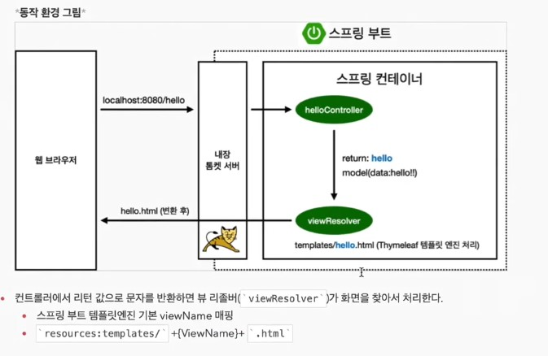
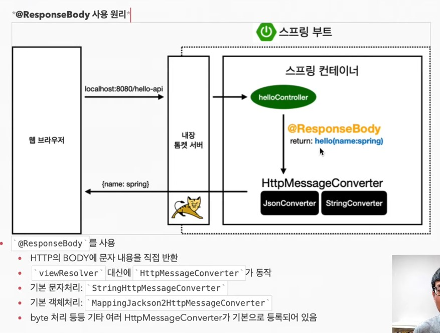
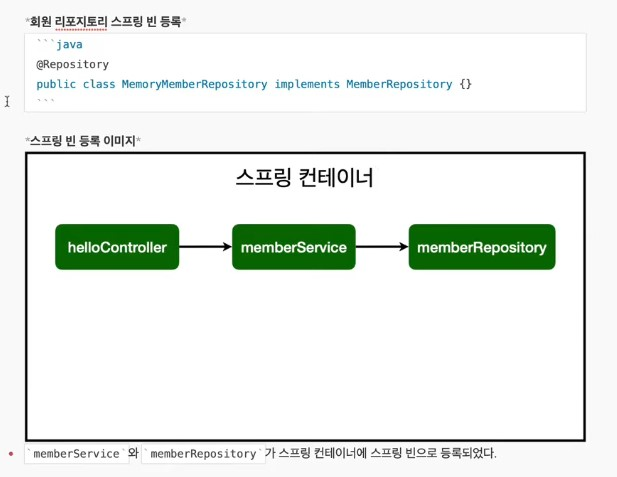

# 스프링

참고 도서

- [배워서 바로 쓰는 스프링 프레임워크](https://ssafy2.dkyobobook.co.kr/content/contentView.ink)
- [스프링 부트 웹애플리케이션 첫걸음](https://ssafy2.dkyobobook.co.kr/content/contentView.ink)

---

## 프로젝트 생성

> `start.spring.io` 로 접속.
>
> Project : Gradle Project
> Lang : Java
> Spring Boot : 
>
> Group : 기업명(도메인)
> Artifact : 프로젝트 명
> Dependencies : 라이브러리
> 	Spring Web : 웹프로젝트
> 	Thymeleaf : 템플릿 엔진 (html)
>
> `Generate` 버튼 클릭

> 다운로드 파일 압축 해제.
>
> ### build.gradle
>
> `build.gradle` Open as project
> plunins 과 Dependencies가 적혀있음.
> **java, String 빨간줄** : project 버전, sdk 버전 일치시켜야함 ㅂㄷㅂㄷ

## MVC와 템플릿 엔진

> Model, View, Controller
>
> Model 화면에 관련된것을 서버에서 화면으로 넘겨주는 역할
>
> View 는 화면
>
> Controller 서버 뒷단의 관련된 것
>
> 
>
> 
>
> 
>
> 컨트롤러 : 외부 요청
> 서비스 : 비즈니스 로직생성
> 레포지토리 : 데이터 저장
>
> 
>
> **Controller**
>
> ```java
> package hello.firstspring.controller;
> 
> import org.springframework.stereotype.Controller;
> import org.springframework.ui.Model;
> import org.springframework.web.bind.annotation.GetMapping;
> import org.springframework.web.bind.annotation.RequestParam;
> import org.springframework.web.bind.annotation.ResponseBody;
> 
> @Controller
> public class HelloController {
> 
>  @GetMapping("hello")
>  public String hello(Model model) {
>      model.addAttribute("data", "hello!!");
>      return "hello";
> //      tamplate의 hello.html로 렌더링
>  }
> 
>  @GetMapping("hello-mvc")
> //    파라미터를 받을거다.
> //    그냥 넘기면 오류가 난다. 파라미터가 디폴트 값이 true이기 때문에 값이 존재해야함.
>  public String helloMvc(@RequestParam("name") String name, Model model) {
>      model.addAttribute("name", name);
>      return "hello-template";
>  }
> 
>  @GetMapping("hello-string")
>  @ResponseBody //바디부에 응답을 직접 넣어주겠다. 무식하게 문자가 그대로 내려간다. view가 없음.
>  public String helloString(@RequestParam("name") String name) {
>      return "hello " + name; // hello
>  }
> 
>  @GetMapping("hello-api")
>  @ResponseBody
> //    클래스 Hello
>  public Hello helloApi(@RequestParam("name") String name) {
>      Hello hello = new Hello();
>      hello.setName(name);
>      return hello;
>  }
> // 클래스 Hello 선언
> // getter and setter, 단축키 alt + ins
>  static class Hello {
>      private String name;
> 
>      public String getName() {
>          return name;
>      }
> 
>      public void setName(String name) {
>          this.name = name;
>      }
>  }
> }
> ```
>
> 

### 레포지토리 만들기

> Optional : findById()에서 null을 그대로 반환하는 대신 
>
> ```java
> package hello.firstspring.repository;
> 
> import hello.firstspring.domain.Member;
> 
> import java.util.*;
> 
> public class MemoryMemberRepository implements MemberRepository {
> 
>     private Map<Long, Member> store = new HashMap<>();
>     private static long sequence = 0L;
> 
> 
>     @Override
>     public Member save(Member member) {
>         member.setId(++sequence);
>         store.put(member.getId(), member);
>         return member;
>     }
> 
>     @Override
>     public Optional<Member> findById(Long id) {
>         return Optional.ofNullable(store.get(id)); // Optional null이 반환됐을떄
>     }
> 
>     @Override
>     public Optional<Member> findByName(String name) {
>         return store.values().stream()
>                 .filter(member -> member.getName().equals(name)) // 멤버getname이 파라미터 name과 같은지 확인
>                 .findAny(); // 찾아지면 반환. 없으면 Optional에 null이 포함되어 반환
>     }
> 
>     @Override
>     public List<Member> findAll() {
>         return new ArrayList<>(store.values()); //values가 멤버들
>     }
> 
>     public void clearStore() {
>         store.clear();
>     }
> }
> ```
>
> 

### 레포지토리 테스트케이스 작성

> main메서드를 통해서 실행하거나 컨트롤러를 통해 해당 기능을 실행하면, 준비와 실행이 오래 걸리고 반복 실행과 여러 테스트를 한꺼번에 실행하기 어렵다.
>
> => JUnit이라는 프레임워크로 테스트를 실행하여 해결한다.

> TDD(Test-driven development) : 테스트 주도 개발

### 서비스 구현

> ```java
> public class MemberService {
>     private final MemberRepository memberRepository = new MemoryMemberRepository();
> 
> //    회원가입
>     public Long join(Member member) {
>         // 같은 이름이 있는 중복 회원 X
>         validateDuplicateMember(member); // 중복회원 검증
>         memberRepository.save(member);
>         return member.getId();
>     }
>     private void validateDuplicateMember(Member member) {
>         memberRepository.findByName(member.getName())
>                 .ifPresent(m -> {
>                     throw new IllegalStateException("이미 존재하는 회원"); // 중복햇을때 exception이 터지는지
>                 });
>     }
> 
> //    전체회원조회
>     public List<Member> findMembers() {
>         return memberRepository.findAll();
>     }
> 
>     public Optional<Member> findOne(Long memberId) {
>         return memberRepository.findById(memberId);
>     }
> }
> 
> ```
>
> 

### 스프링 빈과 의존관계

> 화면에 표시하기 위해 컨트롤러와 뷰 템플릿이 필요
>
> 컨트롤러가 회원ㅅ서비스를 통해 회원가입과 조회를 하고 데이터를 조회할 수 있어야한다.
>
> 스프링 빈을 등록하고, 의존관계 설정하기
>
> **스프링 빈을 등록하는 2가지 방법**
>
> 1. 컴포넌트 스캔과 자동 의존관계 설정
> 2. 자바 코드로 직접 스프링 빈 등록하기
>
> ### 컴포넌트 스캔과 자동 의존관계 설정
>
> `@Component` 애노테이션이 있으면 스프링 빈으로 자등 등록된다.
>
> 컨트롤러가 스프링 빈으로 자동 등록된 이유도 컴포넌트 스캔 때문이다.
>
> 
>
> 
>
> ### 자바코드로 직접 스프링 빈 등록하기
>
> ```java
> SpringConfig 생성
>     Bean 생성 
> ```
>
> 
>
> 실무에서는 주로 정형화된 컨트롤러, 서비스, 레포지토리 같은 코드는 컴포넌트 스캔을 사용한다.
>
> 정화화 되지 않거나, 상황에 따라 구현 클래스를 변경해야하면 설정을 통해 스프링 빈으로 등록한다.
>
> **스프링 컨테이너, DI 는 보다 깊은 배경이 필요로 함** 

## JDBC Template

> 순수 JDBC와 동일한 환결설정에서
>
> 스프링 Jdbc Template과 MyBatis 같은 라이브러리는 JDBC API에서 본 반복 코드를 대부분 베거하지만,
>  SQL은 직접 작성해야 한다.
>
> ### 

## JPA(Java Persistence API)

> EJB
>     과거의 자바 표준 (Entity Bean)
>     과거의 ORM
>          코드가 매우 지저분하다.
>         API의 복잡성이 높다. (interface를 많이 구현해야 함)
>         속도가 느리다.
>
> Hibernate
>     ORM 프레임워크, Open Source SW
>     ‘Gavin King’ 과 시러스 테크놀로지스 출신 동료들이 EJB2 스타일의 Entity Beans 이용을 대체할 목적으로 개발하였다.
>
> JPA (Java Persistence API)
>     현재 자바 진영의 ORM 기술 표준으로, 인터페이스의 모음이다.
>         즉, 실제로 동작하는 것이 아니다.
>         JPA 인터페이스를 구현한 대표적인 오픈소스가 Hibernate라고 할 수 있다.
>     JPA 2.1 표준 명세를 구현한 3가지 구현체: Hibernate, EclipseLink, DataNucleus
>     버전
>         JPA 1.0(JSR 220) 2006년 : 초기 버전. 복합 키와 연관관계 기능이 부족
>         JPA 2.0(JSR 317) 2009년 : 대부분의 ORM 기능을 포함, JPA Criteria 추가
>         JPA 2.1(JSR 338) 2013년 : 스토어드 프로시저 접근, 컨버터(Converter), 엔티티 그래프 기능이 추가
